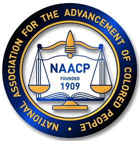

# Hack For A Cause

## Team: MarionBerries

This project was developed during the 2018 Hack For a Cause event in Eugene, OR. It addresses the QR Donation challenge submitted by Adam Wendt from the [Eugene/Springfield NAACP](http://naacplanecounty.org/).

## Challenge: Easy Donations

Existing payment scheme was not intuitive to NAACP staff and donors. The Challenge Champion wanted to have a payment method that are:

- Easy to pay through QR or other technnologies
- Specific to five different causes (youth council, general fund, legal redress, ACT-SO, and Maddie Reynolds scholarship)
- Doesn't require login to specific payment scheme for those who don't have accounts, but only their credit card
- Collects donor's information (name, address, email, phone)

## Solution

### Wordpress E-Commerce Integration:

The existing payment method was using the legacy Paypal extention. Donors were unable to donate to specific causes or add their contact information. Donors were forced to fill out paper slips with their credit card info in order to donate. Our solution implemented WooCommerce to provide donor with a better interface and more payment options.

- Wordpress

### Payment Options:

[Paypal with WooCommerce](https://docs.woocommerce.com/document/paypal-standard/)
[Stripe with Woocommerce](https://woocommerce.com/products/stripe/)

### LightSail:

The team used AWS LightSail to spin up an instance of the existing Wordpress site using Amazon AWS free tier.

[AWS LightSail](https://aws.amazon.com/lightsail/)

### Access points:

We used the following technologies to implement our solution. Usage of these technologies eliminate the need to enter NAACP website and navigate to payment page.

- Bluetooth Beacons
- NFC Tags
- QR code

## License

[MIT](https://github.com/Hack4Eugene/qr-donation-by-marionberries/blob/master/LICENSE)
